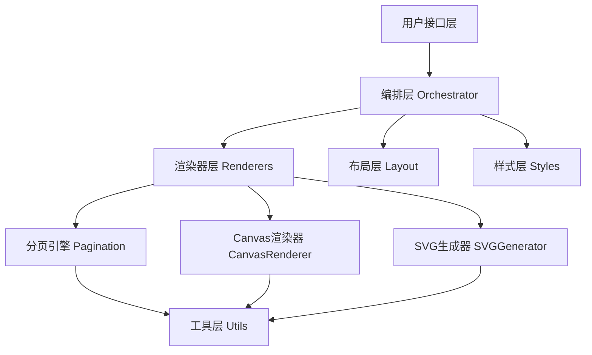

# PDF导出功能设计文档

## Overview

PDF导出功能是"人生K线"应用的核心功能模块之一,负责将用户的八字分析结果(包括封面、八字排盘、K线图、五维评分等11个页面)转换为高质量的PDF报告。

该功能采用模块化、面向对象的设计,通过分层架构(编排层→渲染器层→服务层→工具层)实现清晰的职责划分和高度的可维护性。

## Steering Document Alignment

### Technical Standards (tech.md)

本设计遵循以下技术标准:

1. **TypeScript严格模式**: 所有代码使用TypeScript编写,启用严格类型检查
2. **ESLint规则**: 遵循项目的ESLint配置,保持代码风格一致
3. **React 19**: 使用React 19最新特性,如并发渲染和自动批处理
4. **Zod验证**: 使用Zod进行运行时类型验证,确保数据安全

### Project Structure (structure.md)

本设计遵循项目的目录结构规范:

```
src/components/ExportPDF/
├── core/                  # 核心服务层
├── renderers/             # 页面渲染器层
├── layout/               # 布局系统
├── styles/               # 样式系统
├── svg/                  # SVG生成器
├── utils/                # 工具函数
└── index.ts              # 公共API入口
```

## Code Reuse Analysis

### Existing Components to Leverage

- **Zustand Store**: 获取用户的分析结果数据(八字数据、K线数据、五维评分)
- **Recharts K线图**: 复用现有的K线图数据结构和计算逻辑
- **Lunar-javascript**: 复用八字计算功能
- **UI组件**: 可能复用部分React组件(如卡片、按钮等样式)

### Integration Points

- **ExportButton组件**: 用户触发PDF导出的入口点
- **分析结果页面**: 获取当前页面的分析数据
- **Toast通知**: 显示PDF生成进度和错误信息
- **文件下载**: 触发浏览器下载PDF文件

## Architecture

PDF导出功能采用**分层架构**结合**面向对象设计**,确保高内聚、低耦合。

### 设计原则

1. **单一职责**: 每个类/模块只负责一个明确的功能
2. **开放封闭**: 通过抽象基类和接口定义扩展点,无需修改现有代码即可添加新页面
3. **依赖倒置**: 依赖抽象接口而非具体实现
4. **组合优于继承**: 核心服务通过组合方式使用

### 架构分层



### 模块化设计原则

- **单文件职责**: 每个文件只负责一个特定的领域(如分页引擎、布局引擎)
- **组件隔离**: 创建小而专注的组件,避免大型单体文件
- **服务层分离**: 数据访问、业务逻辑、表现层分离
- **工具模块化**: 将工具函数拆分为专注的、单一目的的模块

## Components and Interfaces

### Component 1: PDFOrchestrator (编排器)

- **Purpose**: 管理PDF生成的整个生命周期,协调各个页面渲染器,聚合最终PDF文档
- **Interfaces**:
  ```typescript
  interface IPDFOrchestrator {
    generatePDF(options: GeneratePDFOptions): Promise<Blob>;
    getProgress(): PDFProgress;
    cancel(): void;
  }
  ```
- **Dependencies**: PageRenderers, jsPDF, CacheManager
- **Reuses**: 使用Promise.all并行渲染页面提高效率

### Component 2: BasePageRenderer (基类)

- **Purpose**: 定义所有页面渲染器的通用接口和生命周期钩子
- **Interfaces**:
  ```typescript
  interface IPageRenderer {
    render(): Promise<PDFPage>;
    getContent(): HTMLElement;
    validate(): boolean;
  }
  ```
- **Dependencies**: 无(抽象基类)
- **Reuses**: 提供页码、水印等通用功能

### Component 3: PaginationEngine (分页引擎)

- **Purpose**: 检测内容是否溢出,识别可分页断点,执行智能分页
- **Interfaces**:
  ```typescript
  interface IPaginationEngine {
    measure(element: HTMLElement): MeasurementResult;
    findBreakPoints(content: HTMLElement): PageBreak[];
    paginate(content: HTMLElement, maxHeight: number): HTMLElement[];
  }
  ```
- **Dependencies**: DOM API
- **Reuses**: 使用getBoundingClientRect()测量元素高度

### Component 4: LayoutEngine (布局引擎)

- **Purpose**: 实现各种布局模式(流式、弹性、网格),计算元素位置和尺寸
- **Interfaces**:
  ```typescript
  interface ILayoutEngine {
    applyFlowLayout(container: HTMLElement, options: FlowOptions): void;
    applyFlexLayout(container: HTMLElement, options: FlexOptions): void;
    applyGridLayout(container: HTMLElement, options: GridOptions): void;
  }
  ```
- **Dependencies**: DOM API, CSS Flexbox/Grid
- **Reuses**: 使用现代CSS布局特性

### Component 5: StyleSheet (样式系统)

- **Purpose**: 定义主题样式,管理样式继承,提供样式工具函数
- **Interfaces**:
  ```typescript
  interface PDFStyles {
    page: PageStyles;
    typography: TypographyStyles;
    colors: ColorPalette;
    components: ComponentStyles;
  }
  ```
- **Dependencies**: 无
- **Reuses**: 集中管理所有PDF样式,支持三种主题

### Component 6: KLineChartGenerator (K线图生成器)

- **Purpose**: 生成高质量的SVG K线图,适配不同主题和DPI
- **Interfaces**:
  ```typescript
  interface IKLineChartGenerator {
    generate(options: KLineChartOptions): string; // 返回SVG字符串
  }
  ```
- **Dependencies**: 无
- **Reuses**: 使用智能算法计算K线宽度和坐标轴刻度

### Component 7: CacheManager (缓存管理器)

- **Purpose**: 缓存渲染结果,管理缓存生命周期,提供缓存统计
- **Interfaces**:
  ```typescript
  interface ICacheManager {
    get(key: string): HTMLCanvasElement | null;
    set(key: string, value: HTMLCanvasElement): void;
    has(key: string): boolean;
    clear(): void;
    getStats(): CacheStats;
  }
  ```
- **Dependencies**: 无
- **Reuses**: 实现LRU缓存策略

## Data Models

### GeneratePDFOptions

```typescript
interface GeneratePDFOptions {
  // 用户数据
  name: string;
  birthDate: string;
  birthTime: string;
  baziData: BaziResult;
  dimensionsData: SixDimensions;
  klineData: KLineData[];

  // 配置
  themeName?: ThemeName;
  pageSize?: PageSize;
  orientation?: PageOrientation;

  // 回调
  onProgress?: (progress: number, stage: string) => void;
  onError?: (error: PDFError) => void;
}

type ThemeName = 'chinese' | 'cyberpunk' | 'minimal';
type PageSize = 'A4' | 'A3' | 'Letter';
type PageOrientation = 'portrait' | 'landscape';
```

### PDFProgress

```typescript
interface PDFProgress {
  current: number;      // 当前页码
  total: number;        // 总页数
  stage: string;        // 当前阶段
  percentage: number;   // 百分比
}
```

### PDFError

```typescript
interface PDFError {
  code: ErrorCode;
  message: string;
  stage: string;
  details?: unknown;
}

type ErrorCode =
  | 'INIT_ERROR'
  | 'RENDER_ERROR'
  | 'CANVAS_ERROR'
  | 'PDF_GENERATION_ERROR'
  | 'CACHE_ERROR';
```

### MeasurementResult

```typescript
interface MeasurementResult {
  height: number;        // 实际高度 (mm)
  width: number;         // 实际宽度 (mm)
  overflows: boolean;    // 是否溢出
  overflowAmount: number; // 溢出量 (mm)
}
```

### PageBreak

```typescript
interface PageBreak {
  position: number;      // 断点位置 (mm)
  type: BreakType;
  element: HTMLElement;  // 断点处的元素
}

type BreakType =
  | 'paragraph'     // 段落之间
  | 'table-row'     // 表格行之间
  | 'section'       // 章节之间
  | 'forced';       // 强制分页
```

## Error Handling

### Error Scenarios

1. **场景1: DOM渲染失败**
   - **处理**: 捕获DOMException,包装为PDFError,通过onError回调通知用户
   - **用户影响**: 显示错误提示"页面渲染失败,请重试"

2. **场景2: Canvas转换失败**
   - **处理**: 捕获html2canvas异常,记录详细日志,提供降级方案
   - **用户影响**: 显示错误提示"图表转换失败,尝试使用简化渲染"

3. **场景3: PDF生成失败**
   - **处理**: 捕获jsPDF异常,清理临时资源,报告详细错误信息
   - **用户影响**: 显示错误提示"PDF生成失败,请检查浏览器兼容性"

4. **场景4: 缓存溢出**
   - **处理**: 触发LRU淘汰策略,记录缓存统计信息
   - **用户影响**: 无感知,自动处理

5. **场景5: 内容溢出无法分页**
   - **处理**: 强制在当前断点分页,记录警告日志
   - **用户影响**: 可能有少量内容在页面边缘被截断

### 错误处理策略

- **错误分类**: 区分可恢复错误和不可恢复错误
- **错误日志**: 记录详细的错误上下文(阶段、输入、堆栈)
- **用户提示**: 提供清晰、可操作的错误信息
- **降级处理**: 对于非关键错误,提供降级方案继续执行

## Testing Strategy

### Unit Testing

- **测试覆盖目标**: > 80%
- **关键组件测试**:
  - PaginationEngine: 测试分页算法边界情况(溢出、断点识别)
  - LayoutEngine: 测试不同布局模式
  - KLineChartGenerator: 测试K线宽度计算、刻度算法
  - CacheManager: 测试LRU淘汰策略
  - 各个PageRenderer: 测试页面内容生成逻辑

**示例测试**:
```typescript
describe('PaginationEngine', () => {
  it('should detect content overflow', () => {
    const element = createTestElement(300); // 300mm
    const result = engine.measure(element);
    expect(result.overflows).toBe(true);
    expect(result.overflowAmount).toBe(3);
  });

  it('should not split table rows', () => {
    const table = createTableWithRows(5);
    const pages = engine.paginate(table, 297);
    // 验证表格行不被截断
    pages.forEach(page => {
      const rows = page.querySelectorAll('tr');
      rows.forEach(row => {
        const rect = row.getBoundingClientRect();
        expect(rect.height).toBeLessThanOrEqual(297);
      });
    });
  });
});
```

### Integration Testing

- **测试覆盖**: 核心流程集成
- **关键流程测试**:
  - PDFOrchestrator完整生成流程(11个页面)
  - 并行渲染正确性
  - 缓存机制有效性
  - 错误处理流程

**示例测试**:
```typescript
describe('PDF Generation Integration', () => {
  it('should generate 11-page PDF', async () => {
    const options = createMockOptions();
    const blob = await generatePDFReport(options);

    expect(blob).toBeInstanceOf(Blob);
    expect(blob.type).toBe('application/pdf');
    expect(blob.size).toBeLessThan(5 * 1024 * 1024); // < 5MB
  });

  it('should complete within 10 seconds', async () => {
    const options = createMockOptions();
    const start = Date.now();

    await generatePDFReport(options);

    const duration = Date.now() - start;
    expect(duration).toBeLessThan(10000);
  });
});
```

### End-to-End Testing

- **测试框架**: Playwright
- **用户场景测试**:
  1. 用户填写出生信息 → 点击导出 → 验证PDF下载成功
  2. 用户切换主题 → 导出 → 验证主题样式正确
  3. 用户生成后再次生成 → 验证缓存生效
  4. 用户在生成过程中取消 → 验证取消成功

**示例测试**:
```typescript
test('should export PDF successfully', async ({ page }) => {
  await page.goto('/analysis/result');

  // 点击导出按钮
  await page.click('[data-testid="export-pdf-button"]');

  // 等待下载完成
  const download = await page.waitForEvent('download');

  // 验证文件名
  const fileName = download.suggestedFilename();
  expect(fileName).toMatch(/人生K线分析报告_.*\.pdf/);

  // 验证文件类型
  const contentType = await download.contentType();
  expect(contentType).toBe('application/pdf');
});
```

## Performance Optimization

### 优化策略

1. **并行渲染**: 使用Promise.all并行渲染多个页面
2. **缓存机制**: 基于内容哈希的LRU缓存
3. **DOM优化**: 使用DocumentFragment减少重排
4. **Canvas优化**: 优化html2canvas配置(scale, quality)

### 性能目标

- PDF生成速度: < 10秒(11页)
- 缓存命中: < 2秒
- 内存占用: < 200MB
- CPU峰值: < 80%

---

**文档版本**: 1.0
**创建日期**: 2026-01-11
**作者**: AI Assistant
**项目**: 人生 K 线 - Life K-line Edge
